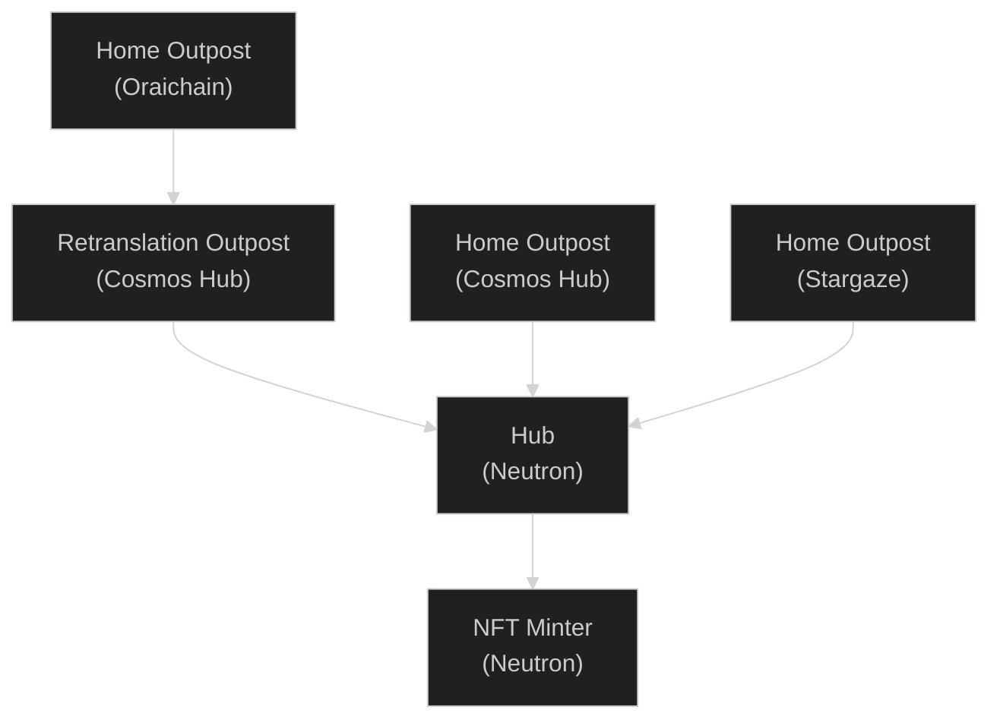

### Project Description

**Simple NFT Bridge** allows to send over IBC whitelisted NFT collections from any home network (directly or through common IBC connected network) to Neutron and vise versa

### Architecture

